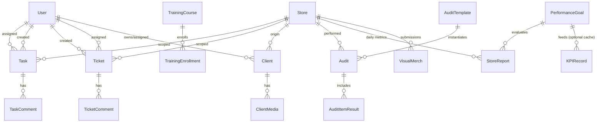

# Diamond Desk – Deep Technical Annex

**Scope:** Supplementary deep‑dive artifacts requested (CloudKit‑only) to accompany the primary Blueprint. This annex covers: ER diagram & narrative, performance targets, conflict resolution matrix, accessibility checklist, localization scaffolding, formal acceptance criteria (stories + Gherkin), DevOps CI/CD definition, and analytics & telemetry taxonomy.

---

## 1. Entity–Relationship Diagram (Conceptual)



### Narrative & CloudKit Mapping

- **Users**: Stored as `User` records; relationships implemented via identifier arrays (e.g., `assignedUserIds`) or `CKRecord.Reference` where cardinality is 1\:N (e.g., `ticketRef` in `TicketComment`).
- **Stores**: Normalize store metadata; most operational records carry a `storeCode` (denormalized) for efficient predicate filtering; we avoid excessive cross‑record joins since CloudKit lacks server‑side join semantics.
- **Tasks & Tickets**: Many‑to‑many user assignment flattened using string ID arrays; comments reference parent by `CKReference` to enable subscription scoping.
- **Client & ClientMedia**: Media separated to prevent large payload bloating primary CRM records, enabling incremental fetch.
- **Audits**: `Audit` references an `AuditTemplate`; individual question results broken into `AuditItemResult` only if per‑item attachments or granular change tracking matter; otherwise could remain JSON array within `Audit` for performance (trade‑off considered).
- **Training**: Enrollment progress separated (`TrainingEnrollment`) to keep course metadata immutable & reduce write contention.
- **PerformanceGoal + StoreReport**: Analytical denormalization; `PerformanceGoal` merges at runtime (no server aggregation). Optional `KPIRecord` caches fused metrics for home dashboard cold‑start reduction.
- **VisualMerch**: Each submission is standalone to simplify approval transitions & asset lifecycles.

> **Indexing Strategy:** Prioritize primitive fields (`storeCode`, `status`, `month`, `weekStart`, `userId`) for predicate performance; avoid deep JSON filters except for niche modules. Tag arrays kept lowercase canonical for case‑insensitive search.

---

## 2. Performance Tuning Benchmarks & Expected Latencies

**Goal:** Define *budget* (target) p50 / p95 latencies under nominal cellular (LTE/5G) and Wi‑Fi, guiding optimization & acceptance.

| Operation / Scenario                            | Description (CloudKit Ops)                                                                     | Target p50 | Target p95 | Notes / Tuning Levers                                                     |
| ----------------------------------------------- | ---------------------------------------------------------------------------------------------- | ---------- | ---------- | ------------------------------------------------------------------------- |
| App Cold Bootstrap (post-auth)                  | Parallel fetch: current User, Stores (≤200), Global PerformanceGoal, 10 newest Tasks & Tickets | ≤1.8s      | ≤3.5s      | Use async tasks + partial rendering skeleton; aggressive field selection. |
| Task List Refresh (assigned)                    | Query ≤50 tasks in zone with predicate on `assignedUserIds`                                    | ≤400ms     | ≤900ms     | Ensure zone change tokens; prefer delta fetch after initial sync.         |
| Ticket Detail Load (with 10 comments)           | Fetch Ticket + batched comment query                                                           | ≤450ms     | ≤1.0s      | Pre-fetch comment IDs in background after list fetch.                     |
| Client List Filter (store scope)                | Query ≤200 clients w/ simple predicates                                                        | ≤700ms     | ≤1.4s      | Maintain local Core Data mirror; remote only for delta; p50 local <80ms.  |
| Save Task Update (status/ack)                   | Single record modify                                                                           | ≤180ms     | ≤400ms     | Coalesce multi-field edits; minimize asset operations.                    |
| Bulk Asset Upload (5 photos ≤500KB each)        | Serialized CKAsset uploads                                                                     | ≤4.0s      | ≤7.0s      | Compress JPEG \~0.7 quality; parallel 2 at a time; show progress.         |
| Subscription Push Propagation                   | Server change → device silent push arrival (foreground)                                        | ≤8s        | ≤20s       | CloudKit variance; local optimistic UI reduces perceived latency.         |
| KPI Dashboard Refresh (cached)                  | Local cache read + selective remote update (StoreReport delta)                                 | ≤300ms     | ≤600ms     | Precompute aggregate nightly + on ingestion pipeline completion.          |
| Ingestion Upsert Batch (Daily Sales 100 stores) | 100 record fetchOrCreate & save                                                                | ≤6s        | ≤12s       | Use modifyRecords in batches (25), exponential backoff on rate limit.     |
| Conflict Merge Resolution                       | Detect server changeTag mismatch + merge + retry                                               | ≤350ms     | ≤800ms     | Keep merge logic synchronous; show subtle UI spinner.                     |

### Measurement Plan

1. **Instrumentation:** Wrap CloudKit operations in timing utility; log to local ring buffer (size‑bounded).
2. **Sampling:** 1 in 10 sessions uploads anonymized aggregate metrics (if user consent) for performance dashboards.
3. **Regression Gates:** CI performance test harness runs against mock CloudKit service; nightly manual run vs staging container for real timings.

### Optimization Techniques

- Limit fetched fields via `desiredKeys` where heavy assets exist.
- Use custom zones for high‑churn types to leverage `CKFetchRecordZoneChangesOperation` tokens.
- Opportunistic prefetch (e.g., once Ticket list loaded, spawn comment prefetch tasks).
- Adaptive throttling: degrade frequency of KPI refresh when network quality (NWPathMonitor) is constrained.

---

## 3. Offline Conflict Edge‑Case Decision Matrix

| Scenario                                                | Example                                                                                  | Detection Mechanism                    | Resolution Strategy                                                                           | User Feedback                                            | Audit Trail?                 |
| ------------------------------------------------------- | ---------------------------------------------------------------------------------------- | -------------------------------------- | --------------------------------------------------------------------------------------------- | -------------------------------------------------------- | ---------------------------- |
| Simultaneous field edits (non-overlapping)              | User A edits title; User B edits dueDate                                                 | Server changeTag mismatch; diff fields | Merge union of differing fields (lastUpdated per field)                                       | Silent success                                           | Yes (merged fields recorded) |
| Simultaneous same field edits                           | Two users change Ticket.status                                                           | changeTag mismatch; same key conflict  | Role precedence (higher role wins) else latest timestamp; loser change stored as comment note | Toast: "Status updated remotely; your change overridden" | Yes                          |
| Delete vs Edit                                          | User A deletes Task; User B completes offline                                            | Save returns `unknownItem`             | Surface soft delete ghost; offer recreate with completion state                               | Banner with undo                                         | Yes                          |
| Assignment change vs completion                         | Admin reassigns Task while Associate marks complete offline                              | changeTag mismatch + assignment diff   | Re-evaluate completion set post-merge; if user no longer assignee remove completion & notify  | Toast and activity log note                              | Yes                          |
| Array append collisions                                 | Two users add different comments to Ticket offline (unlikely; comments separate records) | N/A (separate records)                 | Independent saves succeed                                                                     | Normal optimistic UI                                     | Comments inherently log      |
| Unique key collision (e.g., duplicate StoreReport date) | Two ingestion runs same store/date                                                       | Pre-query by (storeCode+date)          | Upsert (update existing); if metrics differ materially > threshold flag anomaly               | Hidden log; optional admin report                        | Yes                          |
| Versioned document edit while version increments        | Two editors upload new file simultaneously                                               | changeTag mismatch & version compare   | Accept higher version number; lower becomes rejected; prompt user to rebase                   | Alert in document view                                   | Yes                          |
| Client PII redaction vs note edit                       | Compliance redacts field offline while agent adds note                                   | Field-level diff                       | Redaction overrides (privacy priority); note preserved                                        | Subtle info message in note timeline                     | Redaction logged             |
| Audit result updates after close                        | User adds photo offline post completion                                                  | Audit status locked                    | Reject attachment save; propose reopening (privileged roles)                                  | Modal choice                                             | Yes                          |

**General Algorithm:**

1. Attempt save → on `serverRecordChanged` fetch server + compute field diff.
2. For each field category apply policy (last-write, precedence, lock).
3. Produce merged record → reattempt save.
4. Log conflict record (type: `ConflictLog`) for diagnostics.

---

## 4. Accessibility & WCAG + Dynamic Type Compliance Checklist (iOS)

| Area                   | Requirement                                  | Implementation Notes                                                                            | Status (Plan)        |
| ---------------------- | -------------------------------------------- | ----------------------------------------------------------------------------------------------- | -------------------- |
| Color Contrast         | WCAG AA (4.5:1 normal, 3:1 large)            | Use semantic colors (`Color.primary`, `secondary`) & custom tokens tested in light/dark.        | Pending token audit  |
| Dynamic Type           | Support up to Accessibility XXL              | All text uses scalable SwiftUI `Font` styles; multiline truncation strategies defined.          | Scaffolded           |
| VoiceOver Labels       | Descriptive content for interactive elements | Use `.accessibilityLabel` & `.accessibilityHint`; avoid duplication where text already present. | Ongoing              |
| Focus Order            | Logical traversal                            | SwiftUI default order; explicit `.accessibilitySortPriority` for dashboard KPI tiles.           | Planned              |
| Hit Target Size        | ≥44x44pt tappables                           | Use padding & minFrame modifiers.                                                               | In component library |
| Images / Icons         | Provide alt text or marked decorative        | For merch/audit photos: dynamic label summarizing count + status.                               | Planned              |
| Notifications          | Accessible announcements                     | Post `UIAccessibility.announcementString` for real-time changes (task assigned).                | Planned              |
| Motion Sensitivity     | Respect Reduce Motion                        | Conditionally disable complex transitions; use opacity fades.                                   | Planned              |
| Haptics                | Non-critical optional                        | Light haptics for success; disabled if Reduce Motion or system setting off.                     | Planned              |
| Error Messaging        | Clear, actionable                            | Use plain language + inline field highlight; VoiceOver announces change.                        | Planned              |
| Timeouts               | Avoid critical time-based content            | SLA countdown purely informational; accessible text updates.                                    | Planned              |
| Localization Expansion | Layout adapts to long strings                | Auto layout + dynamic text sizing test harness.                                                 | Planned              |
| Theming                | Dark mode contrast maintained                | Snapshot tests both schemes.                                                                    | Planned              |
| Data Tables            | Support VoiceOver navigation                 | Use List/Section semantics; for KPI grids supply row/column accessibility values.               | Planned              |
| Custom Controls        | Full accessibility traits                    | Wrap custom toggle / segmented controls with appropriate `accessibilityValue`.                  | Planned              |
| Gestures               | Provide alternatives                         | Any swipe action mirrored by explicit button.                                                   | Planned              |
| State Indication       | Non-color cues                               | Icons + text (e.g., status: "Open", "Closed").                                                  | In design            |
| Testing                | Automated checks                             | UITests verifying Dynamic Type & VoiceOver element counts.                                      | Planned              |

**Process:** Accessibility acceptance is part of each story’s DoD; run manual VoiceOver pass before beta.

---

## 5. Localization / Internationalization Framework Scaffolding

### Principles

- **Key‑Based Strings:** `Namespace.Component.Action` (e.g., `Task.Detail.MarkComplete`).
- **No Hardcoded Dates/Currency:** Use `DateFormatter` & `NumberFormatter` with locale injection.
- **Pluralization:** Use `.stringsdict` entries for counts (e.g., tasks remaining).
- **Bi-Directional Support:** Avoid directional images; adopt SF Symbols where possible; test right‑to‑left by launching with `-AppleTextDirection YES`.

### Folder Structure

```
Localization/
  Base.lproj/Localizable.strings
  Base.lproj/Localizable.stringsdict
  en.lproj/...
  (future) es.lproj/...
```

### Example Strings

```text
/* Task Actions */
"Task.Detail.MarkComplete" = "Mark Complete";
"Task.List.EmptyState" = "No tasks yet";
"Client.Birthday.Upcoming" = "%@'s birthday in %d days"; // name, countdown
```

### Stringsdict Example (Plural)

```xml
<key>Task.Count.Remaining</key>
<dict>
  <key>NSStringLocalizedFormatKey</key>
  <string>%#@tasks@</string>
  <key>tasks</key>
  <dict>
    <key>NSStringFormatSpecTypeKey</key>
    <string>NSStringPluralRuleType</string>
    <key>NSStringFormatValueTypeKey</key>
    <string>d</string>
    <key>one</key>
    <string>%d task remaining</string>
    <key>other</key>
    <string>%d tasks remaining</string>
  </dict>
</dict>
```

### LocalizationService Skeleton

```swift
final class LocalizationService: ObservableObject {
    static let shared = LocalizationService()
    @Published var locale: Locale = .current
    func string(_ key: String, _ args: CVarArg...) -> String {
        String(format: NSLocalizedString(key, comment: ""), arguments: args)
    }
}
```

### Testing

- Script to extract unused keys (SwiftGen or custom) before release.
- Pseudo‑localization build config expands characters to detect truncation: e.g., `[— Task —]`.

---

## 6. Formal Acceptance Criteria Pack

### 6.1 User Stories (Representative)

1. **Task Assignment:** *As an Area Director I can assign a task to multiple stores so that each store’s staff sees and completes it.*
2. **Group vs Individual Completion:** *As a Store Director I can create a task requiring each assigned associate to individually acknowledge completion.*
3. **Ticket Confidentiality:** *As an HR user I can mark a ticket confidential so non‑HR roles at the store cannot view its details.*
4. **CRM Follow-Ups:** *As an Associate I see a filtered list of clients needing follow‑up within the next 7 days.*
5. **Audit Execution:** *As a Store Director I can start an audit from a template and record pass/fail with photos offline.*
6. **Training Progress:** *As an Associate I can view my completion percentage for each assigned training course.*
7. **Visual Merch Approval:** *As an Area Director I can approve or request revisions on store visual merchandising uploads.*
8. **Performance Goals:** *As an Area Director I can set store-specific performance goals overriding global targets.*
9. **Accessibility:** *As any user I can enlarge text size and the app reflows content without truncation.*
10. **Localization Readiness:** *As an Admin I can switch the app locale (test build) and all UI strings appear translated or flagged.*

### 6.2 Gherkin Scenarios (Selected)

**Task Completion (Group):**

```gherkin
Feature: Group task completion tracking
  Scenario: Each assignee must complete
    Given a task "Clean Cases" assigned to users A and B with group completion enabled
    And user A has not completed the task
    And user B has not completed the task
    When user A marks the task complete
    Then the task overall status remains "In Progress"
    And the completion percent displays 50%
    When user B marks the task complete
    Then the task overall status becomes "Complete"
```

**Confidential Ticket Visibility:**

```gherkin
Feature: Confidential ticket restriction
  Scenario: Non-HR user cannot view confidential ticket
    Given a ticket "HR Investigation" marked confidential with flag "HR"
    And user X has role StoreDirector without HR department
    When user X attempts to open the ticket
    Then the ticket details are not shown
    And a message "Restricted" is displayed
```

**CRM Follow-Up Filter:**

```gherkin
Feature: Follow-up list generation
  Scenario: Upcoming follow-up within next 7 days
    Given client C has followUpDate 5 days from now
    And client D has followUpDate 20 days from now
    When the user opens the Follow-Ups view
    Then client C is listed
    And client D is not listed
```

**Audit Offline Photo Attachment:**

```gherkin
Feature: Offline audit media capture
  Scenario: Add photo offline
    Given device is offline
    And an in-progress audit exists
    When the user attaches a photo to item "Display Lighting"
    Then the photo is stored locally and marked pending upload
    When connectivity is restored
    Then the photo uploads automatically
```

**Localization Fallback:**

```gherkin
Feature: Localization fallback
  Scenario: Missing translation key
    Given the app locale is set to "es"
    And the key "Task.Detail.MarkComplete" lacks a Spanish translation
    When the Task Detail view is shown
    Then the English base string "Mark Complete" is displayed
    And a missing-translation log entry is recorded
```

**Accessibility Dynamic Type:**

```gherkin
Feature: Dynamic Type scaling
  Scenario: Extra large accessibility size
    Given system text size is set to Accessibility XXL
    When the user opens the Dashboard
    Then all KPI tiles wrap text without truncation
    And horizontal scrolling is not required
```

### 6.3 Definition of Done (DoD) Additions

- Unit tests for repository logic (≥80% coverage of domain critical paths).
- VoiceOver pass for new interactive views.
- Performance check: new feature does not push cold start > budget.
- Strings extracted; no hardcoded user-facing literals.

---

## 7. DevOps CI/CD Lane Definition (Xcode Cloud / Fastlane)

### Pipeline Stages

1. **Trigger:** Git push to `main` or PR; semantic tag (e.g., `v1.0.0-beta1`).
2. **Static Analysis:** SwiftLint + SwiftFormat validation (fail on warnings threshold > N).
3. **Build & Unit Tests:** Parallel device destinations (iPhone 15, iPad 10th Gen) using Xcode Cloud.
4. **UI Tests (Smoke):** Minimal deterministic flows (login, create task, complete task, fetch KPIs) on single simulator.
5. **Performance Microbench (Optional Nightly):** Run targeted performance tests; compare against stored baselines; fail if regression >15% p95.
6. **Artifact Signing:** Automatic code signing using managed certificates; export `.ipa`.
7. **Distribution:** TestFlight internal (immediate) then external after manual QA gate.
8. **Notification:** Slack / email summary (build time, test pass %, code coverage, size delta > threshold).
9. **Post-Deploy Hooks:** Tag commit, generate release notes from Conventional Commits, upload symbol files (dSYM) for crash symbolication.

### Environment Configuration

- Use build settings file per configuration (`Config/Environment.xcconfig`) controlling analytics sampling rate, log verbosity.
- Sensitive keys (if any Phase 2) stored in encrypted CI secrets; *none required for CloudKit container name* (public identifier only).

### Fastlane Example (Complementary / Local)

```ruby
platform :ios do
  before_all do
    setup_ci
  end

  lane :lint do
    sh "swiftlint --strict"
  end

  lane :unit do
    scan(scheme: "DiamondDesk", devices: ["iPhone 15"], code_coverage: true)
  end

  lane :ui_smoke do
    scan(scheme: "DiamondDeskUITests", devices: ["iPhone 15"], build_for_testing: true)
  end

  lane :beta do
    lint
    unit
    build_app(scheme: "DiamondDesk")
    upload_to_testflight(changelog: changelog_from_git_commits)
  end
end
```

### Quality Gates

- Code coverage ≥60% (rising target as project matures).
- Lint errors = 0, warnings < threshold.
- Binary size delta < +5% week-over-week (monitor asset inclusion).
- Performance baseline pass.

### Rollback Strategy

- If critical regression, expire latest TestFlight build; re-promote previous build (retain last 3 release candidates tagged).

---

## 8. Analytics & Telemetry Event Taxonomy (Privacy-Aligned)

### Principles

- **Minimalism:** Collect only events needed for UX improvement & reliability.
- **No PII in Event Names/Params:** Use opaque IDs (`userId` hashed, `clientId` hashed if needed) – *avoid names, emails, phone numbers.*
- **Consent & Settings:** UserSettings includes `analyticsOptIn: Bool`; default internal users = true, external pilot choose explicitly.
- **On-Device Aggregation:** Derive simple counters client-side; batch upload non-replayable anonymized summaries (Phase 2 optional).

### Naming Convention

`<Domain>.<Entity>.<Action>` (e.g., `Task.Detail.Complete`, `Ticket.Create.Submit`).

### Core Event Set

| Event Name                 | Trigger                        | Key Properties                                       | Privacy Class          | Purpose                         | Sampling |
| -------------------------- | ------------------------------ | ---------------------------------------------------- | ---------------------- | ------------------------------- | -------- |
| App.Session.Start          | Launch to active UI            | `sessionId`, `timestamp`, `appVersion`               | Low                    | DAU / stability                 | 100%     |
| App.Session.End            | Background >30m                | `sessionId`, `durationSec`, `crashFlag`              | Low                    | Retention, crash ratio          | 100%     |
| Task.List.View             | Task list appears              | `visibleCount`, `pendingAckCount`                    | Low                    | Prioritize UI performance       | 50%      |
| Task.Detail.Complete       | User marks complete            | `taskType (group/individual)`, `latencyMs (tap→ack)` | Low                    | Completion friction             | 100%     |
| Task.Ack.Confirm           | Acknowledge required           | `latencyMs`                                          | Low                    | Measure acknowledgment friction | 100%     |
| Ticket.Create.Submit       | New ticket saved               | `hasAttachment:Bool`, `confidentialFlagsCount:Int`   | Sensitive (flags only) | Feature usage                   | 100%     |
| Ticket.Status.Change       | Status update                  | `fromStatus`, `toStatus`, `role`                     | Low                    | Workflow transitions            | 100%     |
| CRM.FollowUp.ListView      | Follow-up filter open          | `resultCount`, `daysWindow`                          | Low                    | Filter efficacy                 | 50%      |
| CRM.Client.DetailView      | Client profile opened          | `hasUpcomingEvent:Bool`                              | Medium (flag only)     | Feature focus                   | 25%      |
| Audit.Start                | Audit initiated                | `templateIdHash`, `storeCode`, `offline:Bool`        | Low                    | Adoption metrics                | 100%     |
| Audit.Complete             | Audit finished                 | `durationMin`, `failCount`                           | Low                    | Process improvement             | 100%     |
| Training.Course.Start      | Playback begins                | `courseIdHash`, `mediaLengthSec`                     | Low                    | Engagement                      | 50%      |
| Training.Course.Complete   | Completion recorded            | `durationMin`, `quizScore`                           | Low                    | Effectiveness                   | 100%     |
| VisualMerch.Upload.Submit  | Submission made                | `photoCount`, `storeCodeHash`                        | Low                    | Throughput monitoring           | 100%     |
| Performance.Dashboard.View | Dashboard displayed            | `loadTimeMs`, `kpiWidgetsVisible`                    | Low                    | Performance optimization        | 50%      |
| Settings.Preference.Change | User toggles setting           | `settingKeyHash`, `from`, `to`                       | Low                    | Understand configuration drift  | 50%      |
| Error.CloudKit.Retry       | Transient error triggers retry | `operationType`, `retryCount`, `errorCode`           | Low                    | Reliability tracking            | 100%     |
| Conflict.Merge.Applied     | Conflict resolution executed   | `recordType`, `fieldConflictCount`, `strategyUsed`   | Low                    | Tune merge heuristics           | 100%     |

### Data Handling & Retention

- **Local Buffer:** Queue events in memory; flush every 60s or on background; discard if offline > 24h (stale).
- **Retention Server-Side:** 90 days raw → 1 year aggregated metrics → purge.
- **Access Control:** Only Admin analytics viewer (Phase 2 interface) can query aggregate metrics; raw events restricted.

### Privacy Compliance Checklist

| Control              | Implementation                                                                                                        |
| -------------------- | --------------------------------------------------------------------------------------------------------------------- |
| User Opt-Out         | Toggle in Settings → stops enqueue + flush pending queue.                                                             |
| Data Minimization    | Quarterly review of event schema; remove unused properties.                                                           |
| Pseudonymization     | Hash user & client IDs (SHA256 + salt) before transmission.                                                           |
| Secure Transport     | HTTPS TLS 1.2+ (standard).                                                                                            |
| No Sensitive Content | Validation layer rejects string properties exceeding safe character sets or containing '@'.                           |
| Right to Erasure     | Opt-out triggers local purge; remote purge script keyed by salted hash (if reversible mapping maintained internally). |

### Future Enhancements

- Differential privacy noise for counts (if external deployment widens).
- On-device ML summarization of performance usage patterns (instead of raw event streaming).

---

## 9. Traceability Matrix (Stories → Events → Metrics)

| Story ID (Section 6)      | Key Events                                      | KPI / Metric                                         |
| ------------------------- | ----------------------------------------------- | ---------------------------------------------------- |
| 1 Task Assignment         | Task.List.View, Task.Detail.Complete            | Adoption (tasks per session)                         |
| 2 Group Completion        | Task.Detail.Complete                            | Completion latency, per-user completion distribution |
| 3 Ticket Confidentiality  | Ticket.Create.Submit, Ticket.Status.Change      | % confidential tickets, status cycle time            |
| 4 CRM Follow-Ups          | CRM.FollowUp.ListView                           | Follow-up coverage (resultCount / total due)         |
| 5 Audit Execution         | Audit.Start, Audit.Complete                     | Audit completion rate, fail ratio                    |
| 6 Training Progress       | Training.Course.Start/Complete                  | Course completion funnel                             |
| 7 Visual Merch Approval   | VisualMerch.Upload.Submit                       | Turnaround time (upload→approval)                    |
| 8 Performance Goals       | Performance.Dashboard.View                      | Dashboard load time, revisit frequency               |
| 9 Accessibility           | (No direct events; measured via manual testing) | N/A                                                  |
| 10 Localization Readiness | Settings.Preference.Change (locale)             | Locale switch adoption                               |

---

## 10. Open Refinements & Validation Tasks

| Area                   | Pending Action                                                            |
| ---------------------- | ------------------------------------------------------------------------- |
| Performance Benchmarks | Validate real device metrics vs targets (5 sample runs).                  |
| Accessibility          | Create automated snapshot diff harness for Dynamic Type tiers.            |
| Localization           | Integrate pseudo-localization lane in CI.                                 |
| Conflict Logging       | Implement `ConflictLog` record & viewer (Admin only).                     |
| Analytics Consent      | Add onboarding consent screen (internal default = yes).                   |
| Event QA               | Build internal console to inspect last 50 queued events (developer mode). |

---

**End of Deep Technical Annex**


